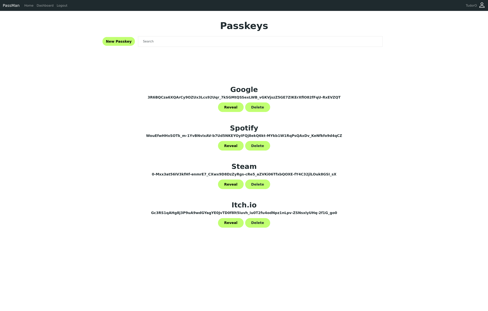
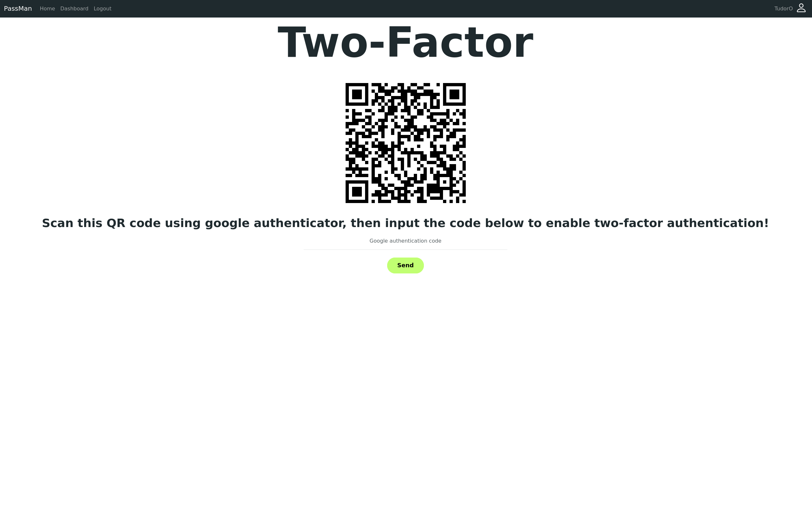

# 🔐 PassMan — Your Secure, Self-Hosted Password Vault


PassMan is a privacy-first, open-source password manager built with Flask, SQLite, and strong cryptography. It offers both client-side and server-side encryption, TOTP-based 2FA, breach detection via HaveIBeenPwned, and a responsive Bootstrap interface.

**No tracking, no data mining — just secure, local-first password storage.**

---

## 📸 Screenshots

> Place screenshots in `docs/screenshots/` and adjust paths below if needed.

### 🔐 Login


### 📋 Vault UI


### 🛡️ TOTP Setup


### 💾 Backup Download


---

## ✨ Features

- 🧠 Master password with AES-GCM + Argon2id key derivation  
- 🔐 Client-side encryption with WebCrypto API  
- 🌐 TOTP 2FA support with QR code provisioning  
- 📦 Encrypted backup files (one-time download)  
- 🔎 Breach check integration with HaveIBeenPwned (k-anonymity API)  
- 🔄 Password reset with master key recovery or backup file  
- 🧹 Automatic key re-encryption on master password change  
- 🧪 Password strength verification with real-time feedback  
- 📱 Mobile-friendly UI with Bootstrap  
- 💨 HTMX-powered UI for smooth, dynamic interactions  
- 🔔 Toastify notifications for success and error messages  
- 💥 Secure by default (CSRF, sessions, content security headers)  

---

## 🚀 Setup

### 🐳 Docker Setup (Recommended)

If you prefer isolation and easier deployment, use Docker:

```bash
git clone https://github.com/TudorOO/PassMan.git
cd PassMan
```
Create a .env file in the root directory. Here’s an example:
```bash
SECRET_KEY=my_secret_key
MAIL_SERVER=smtp.gmail.com
MAIL_PORT=999
MAIL_USERNAME=my_email@gmail.com
MAIL_PASSWORD=my_email_password
AESGCM_CHECK_KEY=my_aesgcm (256 bits)
AESGCM_META_KEY=my_aesgcm_meta
AESGCM_META_NONCE=my_aesgcm_meta_nonce
```
Then build and run the container:
```bash
docker build -t passman .
docker run --env-file .env -p 8000:8000 passman
```

Visit http://localhost:8000 in your browser.

## 🧠 Security Highlights
    🔒 Zero-Knowledge Encryption: Server never sees your decrypted data

    🔐 TOTP Two-Factor Auth: With QR provisioning

    🚨 Password Breach Checker: Know if your credentials have been compromised

    🛡️ CSRF-Protected Forms: Everywhere

    📜 Content Security Policy: Basic headers set
## 🛠️ Roadmap Ideas
    🔁 Password auto-rotation support

    📱 PWA support (Installable web app)

    🧩 Browser extension

    🔐 YubiKey / WebAuthn integration

    🧾 Audit log for security events
## 🤝 Contributing

Pull requests and suggestions are always welcome! Whether it's UI polish, crypto audits, or feature ideas — feel free to fork and submit a PR.
## ⚠️ Disclaimer

PassMan is a security-focused project developed for learning, portfolio building, and personal use. While great care was taken with encryption and security, use at your own risk in production. Security audits are welcome.
## 📄 License

MIT License — do what you want, just don't sell it as yours.